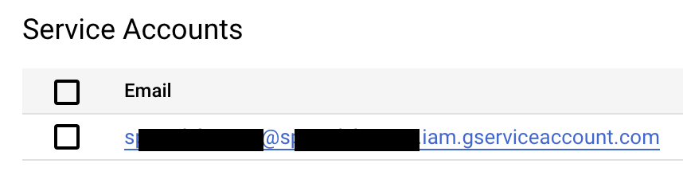
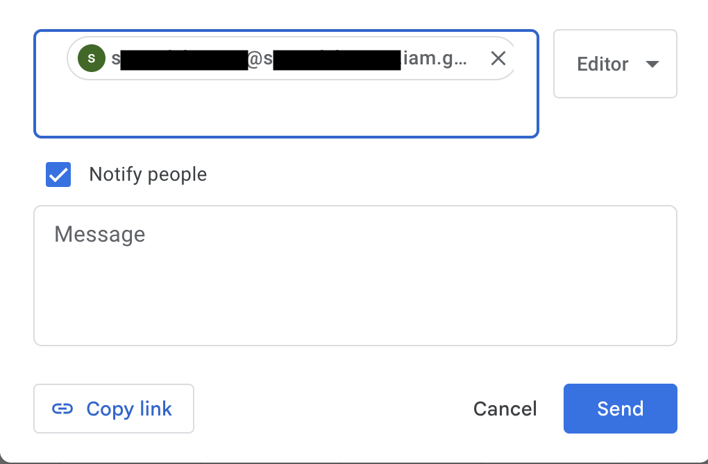
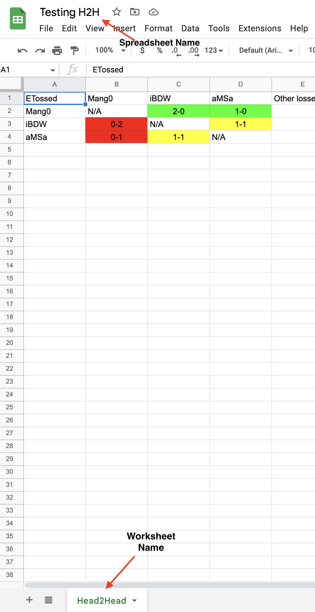

# **Head-to-Head Spreadsheet maker using the startgg api for Python (BETA)**


[](https://pepy.tech/project/pysmashgg)

# **Overview**

#### H2H-Creator-startgg uses [startgg](start.gg)'s API to allow anyone to create their own H2H spreadsheet for any game they want

## **How to install current version**

- Install the latest version of python from [https://www.python.org/downloads/](https://www.python.org/downloads/)
- `pip install H2H_Creator_startgg` installs the latest version of the package (here is the PyPI Page for those interested: [https://pypi.org/project/H2H-Creator-startgg/](https://pypi.org/project/H2H-Creator-startgg/))
- Make sure you have your API Key! Go to your developer settings in your profile on start.gg by clicking on your profile picture in the bottom left corner -- create a new token if you don't have it! The `'KEY'` in the examples is just a placeholder for whatever your API key is

## **FAQ**

- Why do you have a sleep timer?

Well, you see, startgg will deny your API requests if you make too many of them, so I've found that over my hundreds (if not 1000+) of hours of using startgg's API, setting a sleep timer for 15 seconds for every 35 queries works really well, and you can just let the script run. Obviously, you can change that with the variable sleep_time in the H2HMaker object initializiation, but that's where I recommend keeping it -- If the API times you out, there's a function that handles that

- Other features soon?

Win/Loss table maker should be out very soon, which is another way to display the data. Soon you'll be able to import directly from a saved results file from the `get_results()` function, instead of doing it all in one step. Other features coming soon, as well as bug fixes regularly since this is in beta.

## **Required Packages**

- Requests - `pip install requests`
- csv - `pip install csv`
- gspread - `pip install gspread`
- pandas - `pip install pandas`

## **How to use**

```py
from H2HCreatorstartgg import H2HCreator
creator = H2HCreator.H2HMaker("YOUR_KEY_HERE", True)

# Second argument is for json_save, which allows you to save the data that it's going through as a bunch of different json files, check examples folder for an example

# There is an optional third argument called sleep_time (int) which is forced to run because if you attempt too many queries in a row, startgg's API will not respond and will time you out, so sleeping 15 seconds (default of 15) every 6 queries is better
```

## **Main Functions**

```py
from H2HCreatorstartgg import H2HCreator
creator = H2HCreator.H2HMaker("YOUR_KEY_HERE", True, 15)

# create_h2h_spreadsheet(events:list, players:list)
# Usage: Creates H2H.csv file
creator.create_h2h_spreadsheet(["smash-summit-14-presented-by-coinbase", "tournament/genesis-8/event/melee-singles"], ["1c97bdae", "da8b9c25", "cfe7a825"]) 

# create_win_loss_spreadsheet(events:list, players:list)
# Usage: Creates WL.csv file
creator.create_win_loss_spreadsheet(["smash-summit-14-presented-by-coinbase", "tournament/genesis-8/event/melee-singles"], ["1c97bdae", "da8b9c25", "cfe7a825"]) 

# get_tournaments_by_game_during_time_period(self, game:int, after:unix timestamp, before:unix timestamp)
# Usage: Createss json object/file of all tournaments that has an event with a certain game between two timestamps
creator = smash.get_tournaments_with_game_during_time_period(1, 1672102800, 1675746993)

# get_results(self, events:list, players:list)
# Usage: Creates json object/file of all sets from all singles events of given game from all tournaments in given list that include any of the players in given list
creator.get_results(["tournament/smash-summit-14-presented-by-coinbase/event/melee-singles", "tournament/genesis-8/event/melee-singles"], ["1c97bdae", "da8b9c25", "cfe7a825"])

# get_events(tournaments:list, game)
# Usage: Creates json object/file of all singles events from all tournaments in given list from given game
# Use https://docs.google.com/spreadsheets/d/1l-mcho90yDq4TWD-Y9A22oqFXGo8-gBDJP0eTmRpTaQ/ to find the game id you're looking for
creator.get_events(["smash-summit-14-presented-by-coinbase", "genesis-8"], 1)

# get_players_info(player_list:list)
# Usage: Creates json object/file of details about each player inputted
creator.get_players_info(["1c97bdae", "da8b9c25", "cfe7a825"])
```

# **How to get Tournament/Player Slugs**

- Tournaments
  - Go to tournament url like: https://www.start.gg/tournament/genesis-8/details
  - "genesis-8" from that URL is the slug for all the functions listed above
- Players
  - Go to player profile url like: https://www.start.gg/user/1c97bdae/details (this is Mango)
  - "1c97bdae" from that URL is the slug for all functions listed above

# **Auxiliary Functions**

```py
from H2HCreatorstartgg import H2HCreator
creator = H2HCreator.H2HMaker("YOUR_KEY_HERE", True, 15)

# These are basically useless but it's standard to make these in OOP

# Sets new key
creator.set_key("NEW_KEY")

# Sets save_json flag
# Arg: Saving json file boolean
creator.set_save_json(False)

# Sets new sleep_time
# Arg: Sleep time, seconds (int)
creator.set_sleep_time(16)

# Prints key
creator.print_key()

# Prints header
creator.print_header()

# Prints sleep_time
creator.print_sleep_time()
```

# **Link to Google Sheets**
- Dumps information from *H2H.csv* created using the `create_h2h_spreadsheet` as mentioned above, and color codes the winning, losing, and tied records for easier viewing
- You must have a Service Account created through Google to connect service to the spreadsheet. To create one [Follow these instructions](https://docs.gspread.org/en/v5.7.0/oauth2.html#enable-api-access-for-a-project) up to downloading the JSON file. Take a note of where it is saved.
- Create the google sheet you would like to have the information put into, and press the share option and add the email of the service account that you created as an editor for the spreadsheet. 
- 
- 
- Also note the difference between the `Spreadsheet Name` and the `Worksheet Name` 
- 

```py
from H2HCreatorstartgg import spreadsheets

# importSpreadsheet(key_location: str, spreadsheet_name: str, worksheet_name: str, csv_location: str)
# Send info from csv to google spreadsheet
spreadsheets.importSpreadsheet("JSON_GOOGLE_SERVICE_KEY_PATH", "SPREADSHEET_NAME", "WORKSHEET_NAME", "H2H_CSV_PATH")
```
